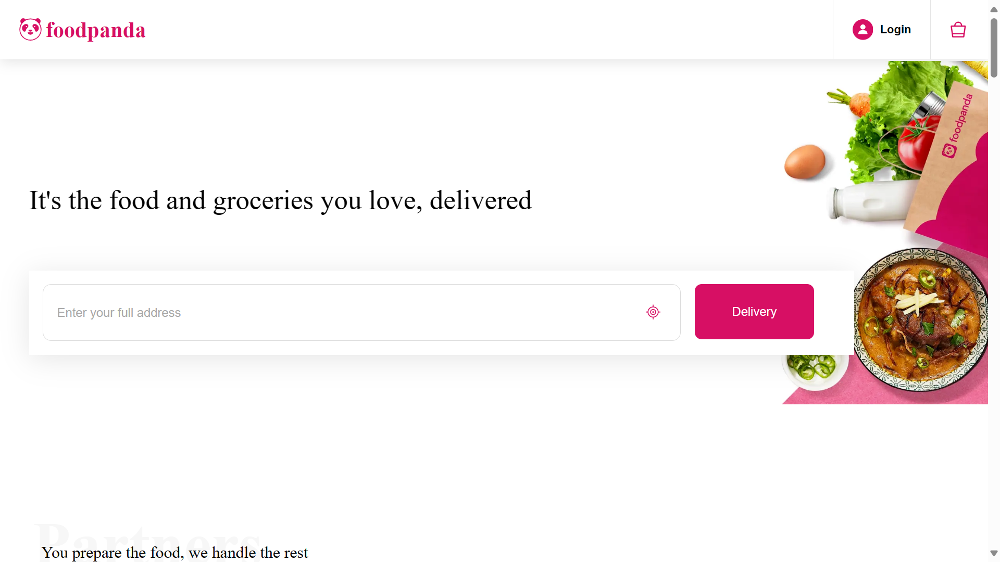
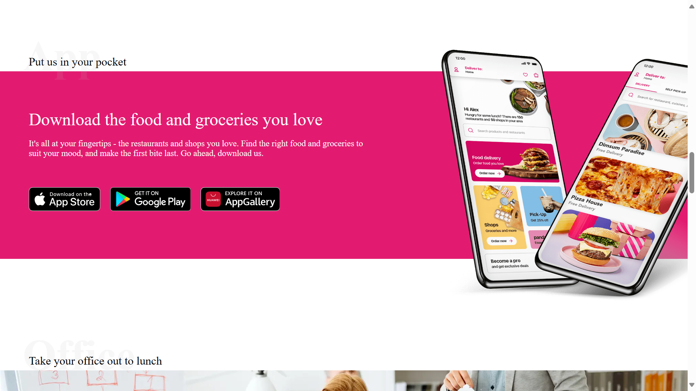

# 🐼 foodpanda-clone 

## Overview
This project is a clone of the popular food delivery service, Foodpanda. It allows users to order food from various restaurants and have it delivered to their location.

## 🔗 Project URL
Check out the live version of the project here: [foodpanda-clone](https://foodpanda-clone-website.netlify.app/)

## 🖼️ Screenshots
Here are some screenshots showcasing foodpanda-clone:

## 🛠️ Technologies Used
- **HTML**
- **CSS**

## 🚀 Getting Started
To run this project locally, follow these steps:
1. Clone the repository: `git clone https://github.com/Developer-Bilal/foodpanda-clone.git`
2. Navigate to the project directory: `cd foodpanda-clone`
3. Open the HTML file in your preferred browser.

## 📧 Contact
If you have any questions or suggestions, feel free to reach out:

- Email: bilalchanna67@gmail.com ✉️
- LinkedIn: [Profile](https://www.linkedin.com/in/Engineer-Bilal-Channa) 💼